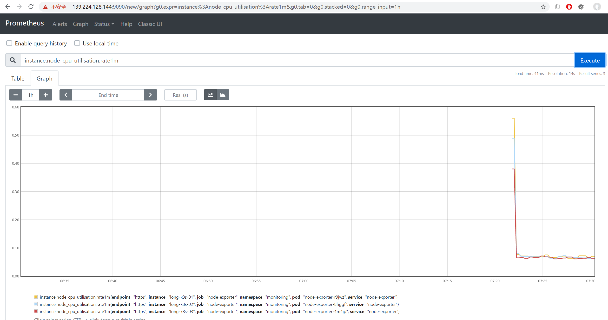
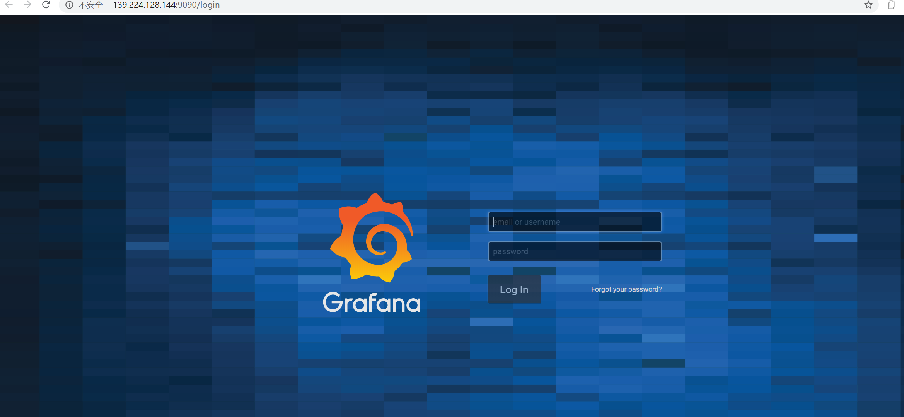

tags: addons, kube-prometheus, prometheus, grafana

# 08-4. 部署 kube-prometheus 插架
<!-- TOC -->

- [08-4. 部署 kube-prometheus 插架](#08-4-部署-kube-prometheus-插架)
    - [下载和安装](#下载和安装)
    - [查看运行状态](#查看运行状态)
    - [访问 Prometheus UI](#访问-prometheus-ui)
    - [访问 Grafana UI](#访问-grafana-ui)

<!-- /TOC -->

kube-prometheus 是一整套监控解决方案，它使用 Prometheus 采集集群指标，Grafana 做展示，包含如下组件：
+ The Prometheus Operator
+ Highly available Prometheus
+ Highly available Alertmanager
+ Prometheus node-exporter
+ Prometheus Adapter for Kubernetes Metrics APIs （k8s-prometheus-adapter）
+ kube-state-metrics
+ Grafana

其中 k8s-prometheus-adapter 使用 Prometheus 实现了 metrics.k8s.io 和 custom.metrics.k8s.io API，所以**不需要再部署** `metrics-server`。
如果要单独部署 `metrics-server`，请参考：[C.metrics-server插件.md](C.metrics-server插件.md)

如果没有特殊指明，本文档的所有操作**均在 long-k8s-01 节点上执行**；

## 下载和安装

``` bash
cd /opt/k8s/work
git clone https://github.com/coreos/kube-prometheus.git
cd kube-prometheus/
# 使用了微软的镜像反而出问题  
# sed -i -e 's_quay.io_quay.azk8s.cn_' manifests/*.yaml manifests/setup/*.yaml # 使用微软的 Registry 这里 sed 使用 _ 做定界符 
# sed -i -e 's/quay.io/quay.azk8s.cn/' manifests/*.yaml manifests/setup/*.yaml # 使用微软的 Registry 这里 sed 使用 / 做定界符  
kubectl apply -f manifests/setup # 安装 prometheus-operator
kubectl apply -f manifests/ # 安装 promethes metric adapter

查看文件改动  
git status  
git diff  

镜像下载问题，往往是下载源出问题    
git checkout -- .  
sed -i -e 's#quay.io#quay.azk8s.cn#' manifests/*.yaml manifests/setup/*.yaml
```

## 查看运行状态

``` bash
$ kubectl get pods -n monitoring
NAME                                  READY   STATUS             RESTARTS   AGE
alertmanager-main-0                   1/2     ImagePullBackOff   0          79s
alertmanager-main-1                   2/2     Running            0          79s
alertmanager-main-2                   2/2     Running            0          79s
grafana-86b55cb79f-qmgvn              1/1     Running            0          78s
kube-state-metrics-65bbb7969-4n9sj    3/3     Running            0          78s
node-exporter-gv9jz                   2/2     Running            0          78s
node-exporter-jq9w7                   0/2     ImagePullBackOff   0          78s
node-exporter-vc9n7                   2/2     Running            0          78s
prometheus-adapter-6d69b78749-lr876   1/1     Running            0          78s
prometheus-k8s-0                      3/3     Running            1          78s
prometheus-k8s-1                      1/3     ImagePullBackOff   0          78s
prometheus-operator-9f6f854c-m7kgp    2/2     Running            0          13m
```

出现 ImagePullBackOff 问题，一些 pod 的状态不对  

怀疑是镜像 pull 问题     

``` bash
检查镜像地址  
grep -ir "image: quay.azk8s.cn/" ./ -n  

检查镜像 imagePullPolicy  
grep -ir "imagePullPolicy" ./manifests/ -A 3 -n
```

强制删除 ns 下的 pod 后，命名空间 monitoring 卡在 Terminating 状态  
更好的删除办法  
kubectl delete -f manifests/setup # 删除 prometheus-operator
kubectl delete -f manifests/ # 删除 promethes metric adapter

K8S 强制删除卡在 Terminating 状态的 namespaces https://www.cnblogs.com/66li/p/12401174.html  
```
kubectl get ns monitoring -o json > tmp.json  
修改文件 tmp.json 内容，删除以下代码段  
"spec": {
    "finalizers": [
        "kubernetes"
    ]
},

查看 apiservice  
netstat -ntlp | grep kube-apiserve  
tcp        0      0 172.19.70.103:6443      0.0.0.0:*               LISTEN      4959/kube-apiserver 

直接调用接口 权限不足  
curl -k -H "Content-Type: application/json" -X PUT --data-binary @tmp.json https://172.19.70.103:6443/api/v1/namespaces/monitoring/finalize

成功
curl -s \
--cacert /etc/kubernetes/cert/ca.pem \
--cert /opt/k8s/work/admin.pem \
--key /opt/k8s/work/admin-key.pem \
-k \
-H "Content-Type: application/json" \
-X PUT \
--data-binary @tmp.json \
https://172.19.70.103:6443/api/v1/namespaces/monitoring/finalize

kubectl get ns
```

```
kubectl apply -f manifests/setup # 安装 prometheus-operator
kubectl apply -f manifests/ # 安装 promethes metric adapter

$ kubectl get pods -n monitoring
NAME                                  READY   STATUS             RESTARTS   AGE
alertmanager-main-0                   1/2     ImagePullBackOff   0          79s
alertmanager-main-1                   2/2     Running            0          79s
alertmanager-main-2                   2/2     Running            0          79s
grafana-86b55cb79f-qmgvn              1/1     Running            0          78s
kube-state-metrics-65bbb7969-4n9sj    3/3     Running            0          78s
node-exporter-gv9jz                   2/2     Running            0          78s
node-exporter-jq9w7                   0/2     ImagePullBackOff   0          78s
node-exporter-vc9n7                   2/2     Running            0          78s
prometheus-adapter-6d69b78749-lr876   1/1     Running            0          78s
prometheus-k8s-0                      3/3     Running            1          78s
prometheus-k8s-1                      1/3     ImagePullBackOff   0          78s
prometheus-operator-9f6f854c-m7kgp    2/2     Running            0          13m
```
仍然有错误  
kubectl describe -n monitoring pod/node-exporter-jq9w7  
查出这个 pod 分配在 03 节点,  
进入 03 节点, crictl images, 发现 images 不存在  

kubectl delete -f manifests/setup # 删除 prometheus-operator
kubectl delete -f manifests/ # 删除 promethes metric adapter

重新部署，仍然有错误  
```
kubectl get pods -n monitoring
NAME                                  READY   STATUS             RESTARTS   AGE
alertmanager-main-0                   2/2     Running            0          35m
alertmanager-main-1                   1/2     ImagePullBackOff   0          35m
alertmanager-main-2                   2/2     Running            0          35m
grafana-86b55cb79f-j4cbj              1/1     Running            0          35m
kube-state-metrics-65bbb7969-5p75r    0/3     ImagePullBackOff   0          35m
node-exporter-d7zsf                   2/2     Running            0          35m
node-exporter-fq48w                   2/2     Running            0          35m
node-exporter-v46cc                   0/2     ImagePullBackOff   0          35m
prometheus-adapter-6d69b78749-j8jtp   1/1     Running            0          35m
prometheus-k8s-0                      3/3     Running            1          35m
prometheus-k8s-1                      1/3     ImagePullBackOff   0          35m
prometheus-operator-9f6f854c-9b8ch    2/2     Running            0          35m
```
节点 03 上的镜像无法下载  
节点 01 上 crictl pull 也失败 镜像源不稳定   
crictl 又没有 docker save 类似的命令 无法做镜像的转移  


最后发现 阿里云的 ECS pull quay.io 的镜像是没有问题的   
**使用了微软的镜像反而出问题**    
**sed -i -e 's_quay.io_quay.azk8s.cn_' manifests/*.yaml manifests/setup/*.yaml # 使用微软的 Registry**     

git checkout -- .  
kubectl apply -f manifests/setup # 安装 prometheus-operator
kubectl apply -f manifests/ # 安装 promethes metric adapter   
```
kubectl get pods -n monitoring
NAME                                  READY   STATUS    RESTARTS   AGE
alertmanager-main-0                   2/2     Running   0          3m59s
alertmanager-main-1                   2/2     Running   0          3m59s
alertmanager-main-2                   2/2     Running   0          3m59s
grafana-86b55cb79f-wz9nx              1/1     Running   0          3m59s
kube-state-metrics-dbb85dfd5-9ncv7    3/3     Running   0          3m59s
node-exporter-prw9f                   2/2     Running   0          3m59s
node-exporter-rtzzw                   2/2     Running   0          3m59s
node-exporter-v7pdc                   2/2     Running   0          3m59s
prometheus-adapter-8656779789-6tb82   1/1     Running   0          3m58s
prometheus-k8s-0                      3/3     Running   1          3m58s
prometheus-k8s-1                      3/3     Running   1          3m58s
prometheus-operator-ccd7974dc-xblv7   2/2     Running   0          6m58s
```
成功  

删除多余的镜像  
crictl rmi  $(crictl images | grep quay.azk8s.cn | awk '{print $3}')

``` bash
$ kubectl top pods -n monitoring
NAME                                  CPU(cores)   MEMORY(bytes)   
alertmanager-main-0                    0m           18Mi            
alertmanager-main-1                    2m           20Mi            
alertmanager-main-2                    0m           19Mi            
grafana-76b8d59b9b-nd6gk               4m           49Mi            
kube-state-metrics-67b7c5dc78-sktzg    11m          29Mi            
kube-state-metrics-959876458-cjtr5     9m           37Mi            
node-exporter-prsvf                    4m           11Mi            
node-exporter-qdh6n                    1m           20Mi            
node-exporter-z6h4z                    5m           11Mi            
prometheus-adapter-5f46ccd66d-bbsns    0m           17Mi            
prometheus-k8s-0                       15m          190Mi           
prometheus-k8s-1                       6m           199Mi           
prometheus-operator-6d8b95b467-htx56   0m           20Mi   
```

## 访问 Prometheus UI

启动服务代理：

``` bash
$ 
$ kubectl port-forward --address 0.0.0.0 pod/prometheus-k8s-0 -n monitoring 9090:9090
Forwarding from 0.0.0.0:9090 -> 9090
```
+ port-forward 依赖 socat。

浏览器访问：http://139.224.128.144:9090/new/graph?g0.expr=&g0.tab=1&g0.stacked=0&g0.range_input=1h




## 访问 Grafana UI

启动代理：

``` bash
$ kubectl port-forward --address 0.0.0.0 svc/grafana -n monitoring 9090:3000 
Forwarding from 0.0.0.0:9090 -> 3000
```

浏览器访问：http://139.224.128.144:9090/

用 admin/admin 登录：


然后，就可以看到各种预定义的 dashboard 了：

 
https://www.jianshu.com/p/7e7e0d06709b Grafana全面瓦解   
```
grafana 是一款采用 go 语言编写的开源应用，主要用于大规模指标数据的可视化展现，  
是网络架构和应用分析中最流行的时序数据展示工具，目前已经支持绝大部分常用的时序数据库。  

最好的参考资料就是官网 http://docs.grafana.org/
```